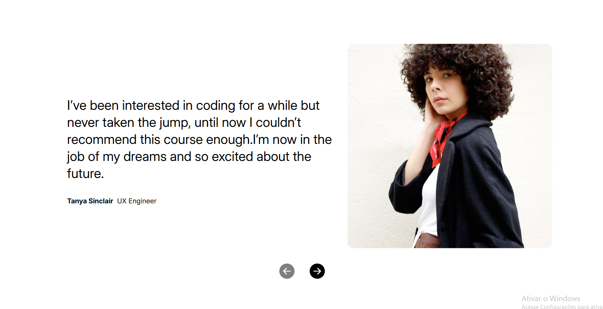

## App pesquisa de filme

Projeto de um carrosel simples treinando o uso do state no React, estando totalmente responsivo

### ⚙️ Acesar o projeto

[Endereço](https://slider-react-iota.vercel.app/)

### 🛠️ Tecnologias utilizadas

- HTML

- CSS

- JAVASCRIPT

- REACT

- STYLED-COMPONENTS

### 🙋🏻‍♂️ AUTOR

João Vitor - Fullstack do projeto - [Github](https://github.com/JoaoVitor2004)

### Licensa

Este projeto foi feito com a licensa [MIT](https://pt.wikipedia.org/wiki/Licen%C3%A7a_MIT)